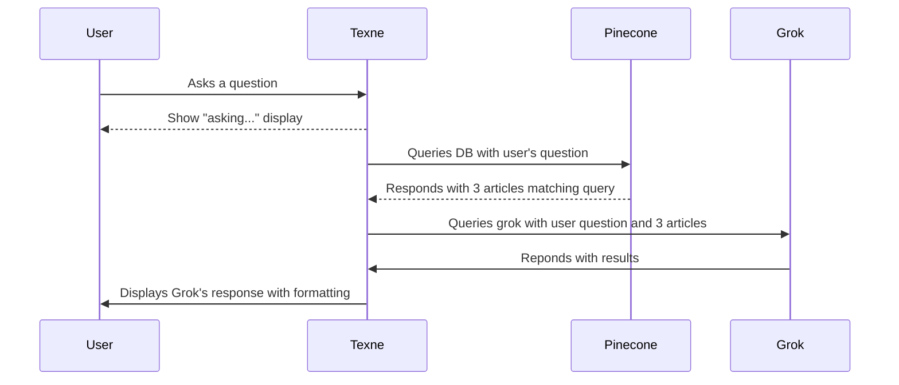

# Texne

Is a simple Phoenix/LiveView application to pull 3 articles from a Pinecone
database, and submit them to Grok to answer the user's question.

## Configuration

The following environment variables need to be defined. You can add these to
your `.env` file:

- `PINECONE_API_KEY` :: Your Pinecone API key
- `PINECONE_BASE_URL` :: The base Pinecone URL you will upload to and against
  which you'll run queries
- `GROK_API_KEY` :: Your Grok API key
- `FILESTORE_PATH` :: The path to the files you want to upload to Pinecone.
  These are the articles against which Texne will query

## Loading Pinecone

You can load files into pinecone with the following command in an IEx shell:

```elixir
Texne.Pinecone.PineconeLoader.load
```

## Running Texne

To start your Phoenix server:

* Run `mix setup` to install and setup dependencies
* Start Phoenix endpoint with `mix phx.server` or inside IEx with `iex -S mix phx.server`

Now you can visit [`localhost:4000`](http://localhost:4000) from your browser.

### Sequence of events



